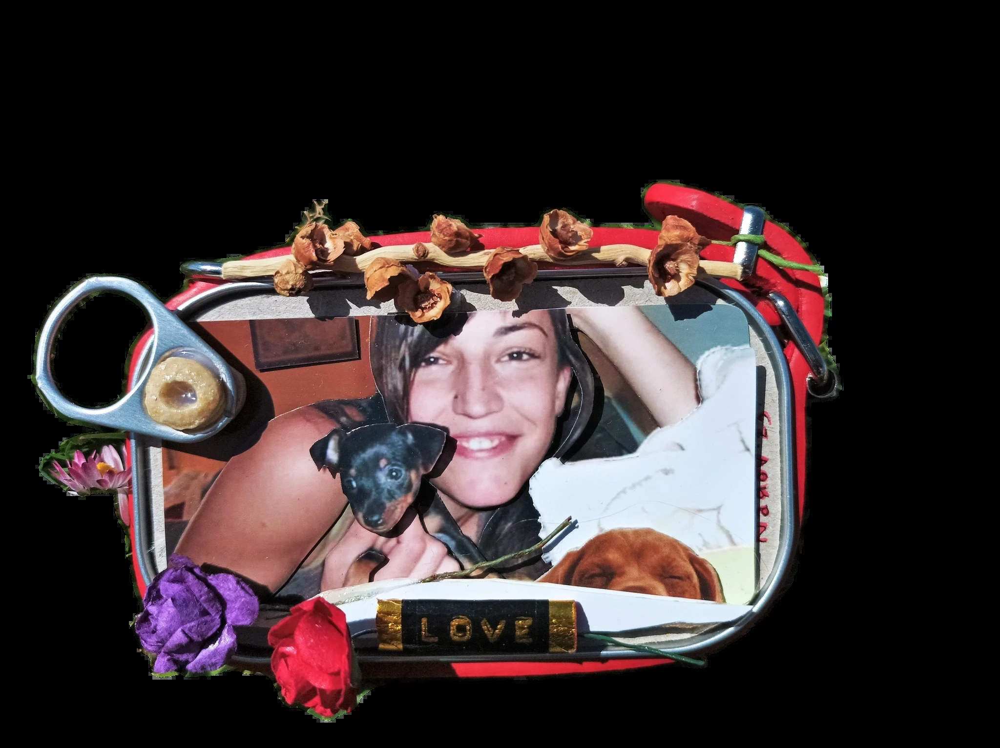

# NOTES.md — Research técnico: experiencia "scroll chapters" (capítulos inmersivos)

> Research para la página estática autocontenida `/public/capitulos/` (portfolio Naroa Gutiérrez Gil).
> Stack validado: **GSAP 3.15.0 + ScrollTrigger + Lenis 1.3.25, todo por CDN, sin build**.
> Verificado el 2026-07-19 (URLs CDN con respuesta 200 y tamaños medidos).

---

## 0. TL;DR

- **Capítulos pinneados**: una `section` 100svh por obra, un `ScrollTrigger` con `pin: true`, `scrub`, `anticipatePin: 1` y `end: "+=150%"`; dentro, una única timeline GSAP que mueve capas parallax (`yPercent` por `data-depth`) y textos sincronizados (entrada/éxodo por posiciones).
- **Lenis + ScrollTrigger**: integración oficial de 4 líneas (`lenis.on('scroll', ScrollTrigger.update)` + `gsap.ticker.add(...)` + `lagSmoothing(0)`). En touch, dejar scroll nativo (`syncTouch: false`, que es el default).
- **Gooey/displacement (Codrops 2019)**: **DESCARTADO** como transición entre capítulos — requiere Three.js/WebGL a pantalla completa, es una técnica pensada para *hover* (no scroll) y su coste (peso, memoria GPU con texturas full-res, riesgo en móvil) no se justifica. Las transiciones se resuelven igual de bien con crossfade + scale + clip-path (transform/opacity). Detalles en §5.
- **Reduced motion**: si `prefers-reduced-motion: reduce` → no instanciar Lenis ni pins; todo el contenido visible con scroll nativo (§1.3 y §4).

---

## 1. Integración Lenis + ScrollTrigger (snippets listos para pegar)

### 1.1 HTML — orden de carga (importa: gsap → ScrollTrigger → lenis → script propio)

```html
<script src="https://cdn.jsdelivr.net/npm/gsap@3.15.0/dist/gsap.min.js"></script>
<script src="https://cdn.jsdelivr.net/npm/gsap@3.15.0/dist/ScrollTrigger.min.js"></script>
<script src="https://cdn.jsdelivr.net/npm/lenis@1.3.25/dist/lenis.min.js"></script>
<script src="./capitulos.js"></script> <!-- o <script> inline al final del body -->
```

El build UMD de Lenis expone el global `Lenis` (`window.Lenis`). GSAP expone `gsap` y `ScrollTrigger`.

### 1.2 CSS recomendado de Lenis (inline, ~0,5 KB — no hace falta linkear su CSS aparte)

```css
html.lenis, html.lenis body { height: auto; }
.lenis.lenis-smooth { scroll-behavior: auto !important; }
.lenis.lenis-smooth [data-lenis-prevent] { overscroll-behavior: contain; }
.lenis.lenis-stopped { overflow: hidden; }
```

### 1.3 JS — setup canónico (oficial del README de Lenis, con fallback reduced-motion)

```js
gsap.registerPlugin(ScrollTrigger);

const reducedMotion = window.matchMedia('(prefers-reduced-motion: reduce)').matches;
let lenis = null;

if (!reducedMotion) {
  // Smooth scroll solo si el usuario no pide movimiento reducido
  lenis = new Lenis({
    lerp: 0.1,          // suavidad (0–1); alternativa: duration: 1.2
    smoothWheel: true,  // suavizar rueda/trackpad
    syncTouch: false    // DEFAULT: en táctil se mantiene scroll NATIVO (¡no tocar!)
  });

  // Sincronizar Lenis con ScrollTrigger
  lenis.on('scroll', ScrollTrigger.update);

  // Lenis vive dentro del ticker de GSAP (un solo rAF para todo)
  gsap.ticker.add((time) => {
    lenis.raf(time * 1000); // gsap da segundos; lenis.raf espera ms
  });

  // Evita saltos de scroll tras un lag (p. ej. al volver de otra pestaña)
  gsap.ticker.lagSmoothing(0);
}
```

**Pitfalls de este bloque:**
- **No uses `autoRaf: true` y el ticker de GSAP a la vez** — es uno u otro. Con ScrollTrigger, el ticker de GSAP es el correcto (misma cadencia de frames → sin doble rAF ni tearing).
- `lenis.raf(time * 1000)`: el `time` del ticker de GSAP viene en **segundos**; Lenis espera **ms**. Olvidar el `* 1000` deja el scroll congelado.
- `lagSmoothing(0)`: sin esto, tras un tirón GSAP "compensa" el tiempo perdido y el scroll salta.
- Si la página tiene anchors internos (`#obra-x`): `new Lenis({ anchors: true })`, o gestionar con `lenis.scrollTo('#obra-x')`.

---

## 2. URLs CDN exactas y versiones recomendadas

Versiones fijadas (nunca `@latest` en producción). Verificadas con HTTP 200 el 2026-07-19:

| Librería | Versión | URL | Tamaño min |
|---|---|---|---|
| GSAP core | **3.15.0** | `https://cdn.jsdelivr.net/npm/gsap@3.15.0/dist/gsap.min.js` | 72,9 KB |
| ScrollTrigger | **3.15.0** | `https://cdn.jsdelivr.net/npm/gsap@3.15.0/dist/ScrollTrigger.min.js` | 44,6 KB |
| Lenis | **1.3.25** | `https://cdn.jsdelivr.net/npm/lenis@1.3.25/dist/lenis.min.js` | 18,4 KB |
| Lenis CSS (opcional, va inline) | 1.3.25 | `https://cdn.jsdelivr.net/npm/lenis@1.3.25/dist/lenis.css` | 0,5 KB |

Total: **~136 KB minificados (~45–50 KB gzip)** — aceptable para una experiencia inmersiva.

- Mirrors equivalentes: `https://unpkg.com/gsap@3.15.0/dist/gsap.min.js`, `https://unpkg.com/lenis@1.3.25/dist/lenis.min.js` (también verificados).
- Importante: GSAP y ScrollTrigger deben ir **a la misma versión exacta**.
- No hace falta Three.js ni ningún otro plugin de GSAP para este proyecto.

---

## 3. Patrón de capítulos pinneados: parallax multicapa + texto sincronizado

### 3.1 Estructura DOM por capítulo (alineada con `manifest.partial.json`)

```html
<main id="chapters">
  <section class="chapter" data-slug="amor-en-conserva"
           style="--dominant:#443738; --blur:url('img/blur-amor-en-conserva.webp')">
    <div class="chapter__bg layer" data-depth="0.15"></div>   <!-- color dominante / textura -->
    <figure class="chapter__art layer" data-depth="0.35">      <!-- obra: LQIP → webp full -->
      
    </figure>
    <div class="chapter__veil layer" data-depth="0.6"></div>   <!-- veladura/grano opcional -->
    <div class="chapter__text">
      <p class="kicker">Capítulo I</p>
      <h2>Amor en conserva</h2>
      <p class="lede">Óleo sobre lienzo · 2023</p>
    </div>
  </section>
  <!-- …una section por obra… -->
</main>
```

Claves CSS: `section { height: 100svh; overflow: clip; }`, capas `position:absolute; inset:0; will-change: transform` solo durante la animación, y `aspect-ratio`/`width`+`height` en `` para que ScrollTrigger calcule bien antes de cargar imágenes.

### 3.2 JS — una timeline scrubbed por capítulo (estructura de triggers)

```js
if (!reducedMotion) {
  gsap.utils.toArray('.chapter').forEach((chapter) => {
    const layers = chapter.querySelectorAll('.layer');
    const text   = chapter.querySelector('.chapter__text');

    const tl = gsap.timeline({
      defaults: { ease: 'none' },            // scrub = progreso lineal; easing por tween si hace falta
      scrollTrigger: {
        trigger: chapter,
        start: 'top top',
        end: '+=150%',                       // 1,5 viewports de "recorrido" por capítulo
        pin: true,
        scrub: 0.6,                          // 0,6 s de inercia → sensación cinematográfica
        anticipatePin: 1,                    // evita el salto al entrar el pin con scroll rápido
        invalidateOnRefresh: true            // recalcula en resize/orientación
      }
    });

    // Parallax multicapa: cada capa viaja a distinta velocidad (transform-only)
    layers.forEach((layer) => {
      const depth = parseFloat(layer.dataset.depth || 0.3);
      tl.fromTo(layer,
        { yPercent:  12 * depth * 10 / 4 },
        { yPercent: -12 * depth * 10 / 4, duration: 1 }, 0);
    });

    // Zoom-out sutil de la obra mientras avanza el capítulo
    tl.fromTo(chapter.querySelector('.chapter__art'),
      { scale: 1.06 }, { scale: 1, duration: 1 }, 0);

    // Texto sincronizado: entra en el primer tercio, sale en el último
    tl.fromTo(text.children,
      { yPercent: 60, opacity: 0 },
      { yPercent: 0, opacity: 1, stagger: 0.04, duration: 0.25, ease: 'power2.out' }, 0.15)
      .to(text.children,
      { yPercent: -40, opacity: 0, stagger: 0.03, duration: 0.2, ease: 'power2.in' }, 0.75);
  });
}
```

**Anatomía del patrón** (lo que hay que respetar al iterar):

1. **Un trigger por capítulo**, no un trigger global: cada `section` se pinnea al llegar a `top top` y retiene al usuario `end: "+=150%"` (ajustable; más % = capítulo más largo/lento).
2. **Una única timeline por capítulo** que contiene TODO (parallax, escala, texto) con posiciones absolutas (`0` → inicio del pin, `1` → final). Así el scrub mantiene texto e imagen siempre sincronizados, también al hacer scroll hacia atrás.
3. **`defaults: { ease: 'none' }`** en tweens scrubbed; los easings expresivos (`power2.out`) solo en los bloques de texto.
4. `anticipatePin: 1` en todos los triggers con pin — es la diferencia entre un pin limpio y un micro-salto visible con rueda rápida o trackpad inercial.
5. Al terminar el pin, la siguiente `section` entra de forma natural; la transición entre capítulos es el propio solape de salida/entrada (crossfade de texto + velocidades de capa distintas). No hace falta ningún efecto extra.

**Variante "stack" (opcional, más barata):** capítulos con `position: sticky; top: 0` apilados y un único trigger global con scrub para el parallax — funciona sin `pin` de ScrollTrigger, pero el texto sincronizado por posiciones es más incómodo. Recomendado empezar con el patrón pinneado de arriba.

### 3.3 Carga progresiva de obra (aprovecha el manifest)

El manifest ya trae `blur` (placeholder ~120–200 B) y `dominantColor`:

```css
.chapter { background: var(--dominant); }
.chapter__art img { background: var(--dominant); }
.chapter__art { background-image: var(--blur); background-size: cover; } /* LQIP debajo del  */
```

Precargar la imagen del **siguiente** capítulo cuando el actual entra en viewport (`ScrollTrigger.onEnter` → `new Image().src = nextSlug`) para que el pin nunca muestre el blur más de un instante. Tras `load` de imágenes o fuentes, llamar `ScrollTrigger.refresh()` (o mejor: dimensiones fijas en `` para no necesitarlo).

---

## 4. Advertencias móviles y de rendimiento

**Regla de oro de animación:**
- Animar **solo `transform` (translate/scale) y `opacity`**. Nada de `top/left/width/height`, `box-shadow` animada, `filter: blur()` a pantalla completa ni `background-position` durante el scroll — todo eso fuerza layout/paint y mata los 60 fps.
- `clip-path` es aceptable con moderación (una máscara por transición, no por capa) y nunca combinado con blur grande.
- `will-change: transform` solo en las capas que se animan y solo mientras el capítulo está activo (GSAP ya gestiona `force3D`); dejar `will-change` permanente en N capas × N capítulos infla memoria GPU.

**Pinning y ScrollTrigger:**
- `anticipatePin: 1` siempre que haya `pin: true`.
- `ScrollTrigger.config({ ignoreMobileResize: true });` → evita que el show/hide de la barra de direcciones del móvil recalcule todos los triggers (saltos de pin).
- Usa **`100svh`/`100dvh`** en vez de `100vh` para las secciones a pantalla completa en móvil.
- `invalidateOnRefresh: true` y valores basados en función (`yPercent`, o `() => window.innerHeight * x`) para que los triggers sobrevivan a rotaciones de pantalla.
- No pinnees alturas desproporcionadas en móvil: `end: "+=150%"` está bien; `+=400%` en un móvil con scroll nativo se hace eterno.

**Lenis en táctil:**
- `syncTouch: false` (default) = el dedo manda con scroll nativo y Lenis solo suaviza rueda/trackpad. **No activar `syncTouch: true`** con pins: se vuelve inestable (documentado por Lenis, especialmente iOS < 16) y el scrub se siente "pegajoso".
- Lenis deja de funcionar sobre iframes y va capeado a 60 fps en Safari (30 en modo ahorro) — asumirlo como límite de diseño, no como bug.
- Si aparece jank en Android de gama baja: degradar con `gsap.matchMedia()` → sin pin, reveals simples con `toggleActions`.

**Accesibilidad / reduced motion (obligatorio):**

```js
// Si reducedMotion === true:
// - No se instancia Lenis (scroll nativo).
// - No se crean pins ni timelines scrubbed.
// - CSS: todas las capas estáticas y el texto visible (opacity: 1; transform: none).
```

**Presupuesto de rendimiento razonable:** ≤ 4 capas parallax por capítulo, imágenes webp ≤ ~500 KB (el manifest ya cumple), un solo `` visible por capítulo, `loading="lazy"` + precarga del siguiente capítulo.

---

## 5. Gooey/displacement estilo Codrops: ¿transición ligera entre capítulos?

**La técnica analizada** ([Codrops, oct 2019](https://tympanus.net/codrops/2019/10/23/making-gooey-image-hover-effects-with-three-js/)): escena Three.js con un plano texturizado sincronizado a la posición DOM, `ShaderMaterial` con dos texturas (normal + hover), y una máscara de mezcla construida con *simplex noise* 3D + círculo difuminado anclado al ratón. La transición es una mezcla por luminancia (`smoothstep` sobre noise+circle) entre dos texturas GPU, dirigida por **hover**.

**Por qué NO encaja aquí (veredicto):**

> ❌ **Descartado como transición entre capítulos — con o sin Three.js.**

1. **Es un efecto de hover, no de scroll.** Reutilizarlo entre capítulos exige rehacerlo: canvas WebGL fijo a pantalla completa, posición/escala del plano recalculada contra el DOM en cada frame del pin, y un uniform `progress` gobernado por ScrollTrigger. Es la arquitectura de una web Awwwards con equipo detrás, no de una página estática autocontenida.
2. **Peso**: three.js min suma ~600 KB (~150 KB gzip) — más que todo el resto del stack junto — para un único gesto visual.
3. **Memoria GPU**: las obras del manifest son hasta 2048×2048; tener N texturas full-res residentes + framebuffers en móvil es la receta para crashes de contexto WebGL en Safari iOS.
4. **La alternativa "sin Three.js" existe pero no escala**: un filtro SVG `feTurbulence` + `feDisplacementMap` animado con GSAP (tween de `attr: { scale }` en el `feDisplacementMap`) produce un liquid-displacement honesto sin WebGL, pero rasterizar ese filtro sobre una imagen a pantalla completa cuesta más CPU/GPU que todo el parallax junto, y Safari es irregular animando parámetros de filtro. Viable como **micro-acento** (p. ej. distorsionar sutilmente el título del capítulo al entrar), no como transición.
5. **Coste de oportunidad**: la inmersión ya la dan el pin + parallax multicapa + texto sincronizado. Una transición líquida encima compite con la obra en vez de servirla — mal trade para un portfolio de artista.

**Recomendación de transición ligera (transform/opacity only):** solape de salida/entrada entre capítulos con `scale` 1.04→1 + crossfade de `opacity` + una capa "velo" con `clip-path: inset()` que revela el siguiente capítulo. Cero dependencias extra, 60 fps en móvil, y coherente con el lenguaje del parallax.

*Si algún día se quiere el gooey de verdad: hacerlo en un solo lugar (p. ej. hero de la home) con el patrón exacto del tutorial Codrops, nunca dentro del loop de capítulos.*

---

## Fuentes consultadas

- [Codrops — Making Gooey Image Hover Effects with Three.js (2019)](https://tympanus.net/codrops/2019/10/23/making-gooey-image-hover-effects-with-three-js/)
- [Lenis — README oficial (darkroom.engineering)](https://github.com/darkroomengineering/lenis) — sección "GSAP ScrollTrigger", opciones (`syncTouch`, `anchors`, `autoRaf`), limitaciones documentadas (60 fps Safari, iOS < 16, iframes).
- jsDelivr data API — versiones `latest` de `gsap` (3.15.0) y `lenis` (1.3.25), y verificación HTTP 200 + tamaño de los builds UMD.
- GSAP ScrollTrigger docs (conocimiento del plugin): `pin`, `anticipatePin`, `scrub`, `invalidateOnRefresh`, `ScrollTrigger.config({ ignoreMobileResize })`.
